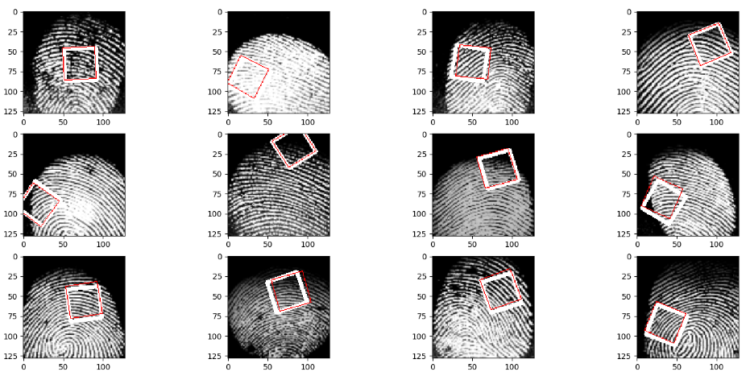

# Robust-Partial-Fingerprint-Alignment

CNN-based Fingerprint alignment

2022.08

# Abstracts.

Real-world fingerprint matching is
important for a fingerprint verification system for mobile devices. Most mobile
and embedded devices have a small fingerprint capture sensor that can capture
ONLY a portion of the fingerprint image. In this work, we present a fast and
robust method for matching fingerprints with neural networks. We use a 2-point
parameterization that maps the two corners of a fingerprint to another
fingerprint. We use the SOCOFing dataset to train our network. The fingerprint
alignment network works without local features extracted from the fingerprint
images. There is a comparison between FP21Net and traditional homography
estimation based on ORB features.

# Dataset

The SOCOFing dataset can be downloaded mannually https://www.kaggle.com/datasets/ruizgara/socofing , and use the scripy [dataset_generate.py] to prepare the dataset for training and evaluation.

After dataset generation in previous step, there will be 4 folders,each one is a dataset with a specificed partial square side length. More inspectoin see [dataset_generate.py].

# Training

We use script [train_multi_model_220704.py] to train the model,between line 272 and 285, that can config the training hyper parameters, in default , the script will produce 96 models (96=4x4x6, 4 ground truth types,4 datasets, 6 base models).

Evaluation log will occur after every epoch data,and the model will be stored after the last epoch trained.

The log file contains all the config parameters and training log for every model training.

# Analyze

There are lots of scripts for analyzing. For research errors of models and ORB feature.

# Report

Performances.

| Model                | Model Size | MAE     |
| -------------------- | ---------- | ------- |
| CV-ORB               | --         | 3269.8  |
| **FP21-MobileNetV2** | **8.5MB**  | **3.7** |
| FP21-ShuffleNetV2    | 4.8MB      | 4.4     |
| FP21-resnet18        | 42.6MB     | 4.7     |
| FP21-densenet121     | 26.5MB     | 9.8     |
| FP21-Googlenet       | 21.4MB     | 19      |
